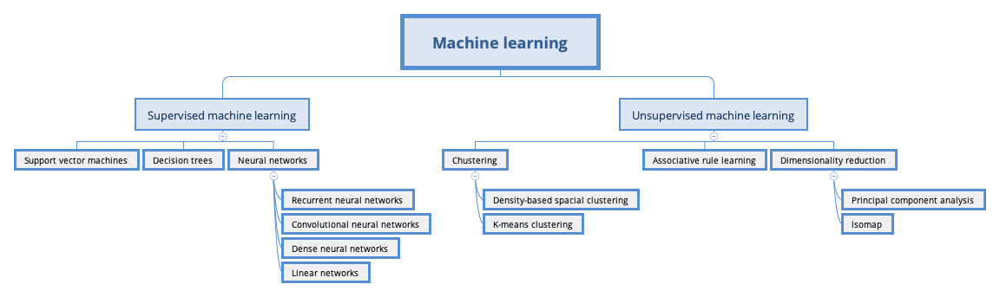

# Machine Learning and Computer Vision

How do you teach a computer the difference between a photo of a car and a photo of a human? As humans we can make the distinction without trying, but teaching this intuition to a computer is much more work. In this section, I'll make how a computer sees an image and how I can use machine learning to teach a computer to identify images programmatically. 

In the section, I'll build an image classifier from scratch. When I have an algorithm that can reliably classify an image as "pedestrian" or "car".

*The majority of this section will focus on supervised learning because the vast majority of machine learning models used in production are supervised.*

**Table of Contents**	

1. [The Need for Machine Learning Design Patterns](./ml/TheNeed4MachineLearningDesignPatterns.md)

